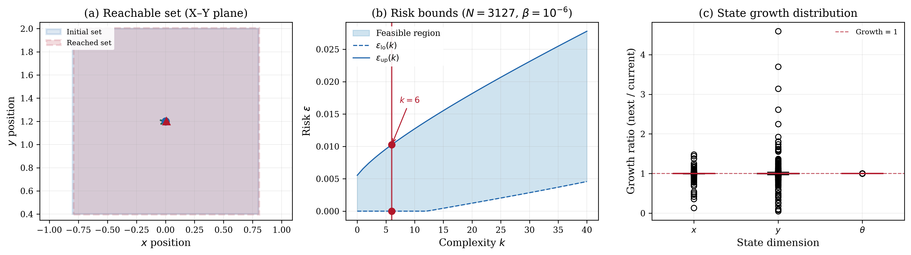

# Data-Driven Growth Bound for Finite Abstraction

## Problem Description

Finite abstractions group continuous states into grid cells, each represented by a cell center. Following Kazemi et al. (2024), we compute a data-driven growth bound from sampled trajectories of a vehicle dynamics system, formulated as a linear program. We consider a 3-dimensional hypercube of side length l = 1.6 centered at (0, 1.2, 0) with bicycle-like dynamics:

    x'(1) = u(1) cos(α + x(3)) / cos(α)
    x'(2) = u(1) sin(α + x(3)) / cos(α)
    x'(3) = u(1) tan(u(2))

where α = arctan(tan(u(2))/2). A total of 3127 trajectories (xₖ, xₖ') are sampled under fixed input u = (0.3, 0.3), where (c, c') denotes the trajectory from the cell center. The growth bound M·[0.5l, 0.5l, 0.5l]' + γ is computed by solving for the matrix M and bias b.

## Formulation

This is a Linear Program with 12 decision variables: 9 entries of the growth matrix M and 3 bias terms b. The objective minimizes the off-diagonal entries of M plus the bias terms. Each scenario δₖ is a 6-dimensional concatenation |xₖ - c|, |xₖ' - c'|. Hard constraints enforce |mᵢᵢ| ≤ bᵢ and mᵢⱼ ≥ 0 when i ≠ j. No regularisation (τ = 0) or slack penalty (ρ = 0).

## Results



The LP solves with N = 3127 sampled trajectories. The optimal growth matrix and bias are:

    M* = [[-1.000, 0.000, 0.005], [0.000, -1.000, 0.009], [0.000, 0.000, -1.000]]
    b* = [-1.000, -1.000, -1.000]

With pre-selected bias γ = 0.067 and β = 10⁻⁶, the support set size is k = 6 and degeneracy was detected, so no lower bound on risk can be certified. The upper bound is ε̄ = 0.01.

## Files

```
LP_growth_bound_12d/
├── README.md           This file
├── parameters.txt      Solver parameters (rho, tau, confidence)
├── generate.py         Generate trajectory data via RK4 simulation
├── run.py              Solve the LP and print results
├── plot.py             Generate the paper figure
├── data/
│   ├── benchmark.json         One-shot program definition (JSON)
│   ├── benchmark.mat          One-shot program definition (MATLAB)
│   ├── A_d.csv                Scenario-dependent constraint matrix (3 × 12 expressions)
│   ├── b_d.csv                Scenario-dependent RHS (3 × 1 expressions)
│   ├── c.csv                  Objective vector (12 × 1)
│   ├── G.csv                  Hard constraint matrix (6 × 12)
│   ├── h.csv                  Hard constraint RHS (6 × 1)
│   ├── growth_bound.csv       Full dataset (3127 × 6)
│   └── growth_bound_mini.csv  Mini dataset (99 × 6)
└── results/
    ├── metrics.json    Solver output (growth matrix, bias, risk bounds)
    ├── solution.csv    Raw solution vector
    ├── growth_bound.png  Paper figure (300 dpi)
    └── growth_bound.pdf  Paper figure (vector)
```

## Usage

```bash
# Regenerate trajectory data
python generate.py

# Solve the LP (use --mini for faster testing)
python run.py
python run.py --mini

# Generate paper figure
python plot.py
```

## Web Interface Usage

### One-Shot Method (Recommended)

1. Start the web server: `python3 app.py`
2. Click **"Detect Program"** button (next to LP/QP/SDP tabs)
3. Upload `data/benchmark.json` or `data/benchmark.mat`
4. Upload `data/scenarios.csv` in the Scenarios box
5. Set solver to **MOSEK** and press **Solve**

### Manual Method

1. Select the **LP** tab, formulation: **Robust**
2. Upload or enter each matrix:
   - **A(delta)**: `data/A_d.csv`
   - **b(delta)**: `data/b_d.csv`
   - **c**: `data/c.csv`
   - **G**: `data/G.csv`
   - **h**: `data/h.csv`
3. Set parameters: rho = 0, tau = 0, confidence (beta) = 1e-06
4. Upload `data/scenarios.csv` in the Scenarios box
5. Press **Solve**

### Expected Results

- Optimal cost: -2.9862583119393014
- Complexity k: 6
- Risk bounds: [0.0, 0.010092109023134854]
