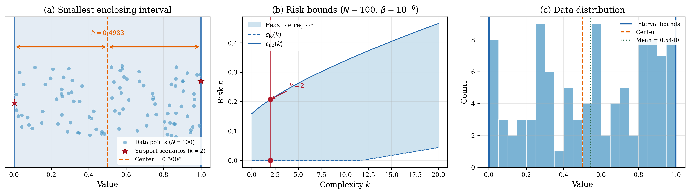

# Smallest Enclosing Interval

## Problem Description

We sample 100 points from the 1-dimensional space [0, 1] and seek the smallest interval that encloses all samples, following the setup in Campi & Garatti (2018). The solution consists of the interval half-width h and center o, i.e., x = [o, h]. Each data point imposes a constraint that it must lie within the interval.

## Formulation

This is a Linear Program with 2 decision variables x = [center, h] and no hard constraints. The objective c = [0, 1] minimizes the half-width. Each scenario δᵢ (a single data point) generates two soft constraints via:

A(δᵢ) = [[-1, -1], [1, -1]], b(δᵢ) = [δᵢ, -δᵢ]

No regularisation (τ = 0) or slack penalty (ρ = 0).

## Results



The LP solves with N = 100 data points. The optimal interval is [0.002, 0.999] with center 0.501 and half-width 0.498. The complexity is k = 2 (the two extreme data points define the interval). With β = 10⁻⁶, the risk bounds are ε̲ = 0 and ε̄ = 0.207.

## Files

```
LP_half_width_2d/
├── README.md           This file
├── parameters.txt      Solver parameters (rho, tau, confidence)
├── run.py              Solve the LP and print results
├── plot.py             Generate the paper figure
├── data/
│   ├── A_d.csv         Scenario-dependent constraint matrix (2 × 2)
│   ├── b_d.csv         Scenario-dependent RHS (2 × 1)
│   ├── c.csv           Objective vector (2 × 1)
│   └── scenarios.csv   100 data points sampled from [0, 1]
└── results/
    ├── metrics.json    Solver output (center, half-width, risk bounds)
    ├── solution.csv    Raw solution vector
    ├── half_width.png  Paper figure (300 dpi)
    └── half_width.pdf  Paper figure (vector)
```

## Usage

```bash
# Solve the LP
python run.py

# Generate paper figure
python plot.py
```
