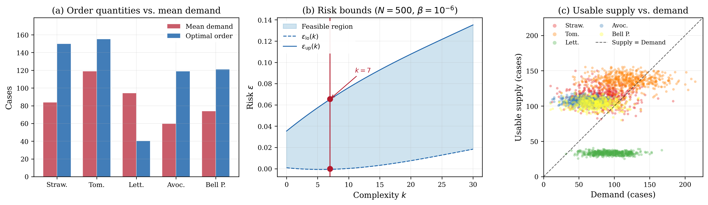

# Inventory Management Benchmark

## Problem Description

A purchasing manager must decide how many cases of fresh produce to order daily from the Oakland Terminal Market. Fresh produce is highly perishable — strawberries might have 25% perished by the time they reach stores. Demand fluctuates based on weather, local events, and seasonal patterns. The purchasing manager has a fixed budget and limited warehouse space. Too few orders means empty shelves and lost sales. Too many and produce spoils on the shelf, a wasted purchase.

Determine optimal daily order quantities for 5 perishable produce items under uncertainty in yield (spoilage), demand, and warehouse packing efficiency. The daily budget is $12,000 and the warehouse has 800 cubic feet of refrigerated space. Products have a maximum order limit of 150-200 cases, item dependent.

| Product | Cost ($/case) | Mean Demand (cases) | Yield (%) | Space (cu.ft) |
|---------|--------------|---------------------|-----------|---------------|
| Strawberries | 18.50 | 85 | 75 (25 loss) | 1.2 |
| Tomatoes | 14.25 | 120 | 88 (12 loss) | 1.5 |
| Lettuce | 12.00 | 95 | 82 (18 loss) | 2.0 |
| Avocados | 32.00 | 60 | 90 (10 loss) | 0.8 |
| Bell Peppers | 22.50 | 75 | 85 (15 loss) | 1.3 |

The data is synthetic but calibrated to real data (Buzby et al. 2014, Perez & Plattner 2017), along with USDA Terminal Market prices for highest grade products.

## Formulation

This is a Linear Program using the shared-slack augmented formulation. The original decision variable q in R^5 (order quantities) is augmented with 6 slack variables zeta (one per scenario constraint) to form x_aug = [q; zeta] in R^11. The slack penalty rho = 100 is embedded directly into the cost vector c_aug = [18.50, 14.25, 12.00, 32.00, 22.50, 100, ..., 100] in R^11, so the solver is called with rho = 0. No regularisation (tau = 0).

Each scenario delta_i in R^15 encodes uncertain yields (delta[0:5]), demands (delta[5:10]), and warehouse packing efficiencies (delta[10:15]), drawn from correlated distributions. The scenario-dependent constraint matrix A_d (6 x 11) enforces that usable supply meets demand (5 rows) and that warehouse capacity is respected (1 row), with -I slack columns absorbing violations. Hard constraints (G: 17 x 11) encode non-negativity on q, supplier limits, daily budget, and non-negativity on zeta.

## Results



The LP solves in 9.07 seconds with N = 500 scenarios. The full budget of $12,000 is used. The penalty rho = 100 implies a cost per case of lost sales; the expected daily loss from stockouts is only $66.20 (about 0.5% of the ordering budget). The LP had complexity k = 7, no degeneracy, and risk bounds [0.000, 0.066] at 99.9999% confidence (beta = 10^{-6}).

| Product | Order (cases) | Mean Demand | Service Level (%) |
|---------|--------------|-------------|-------------------|
| Strawberries | 150.0 | 83.9 | 85.8 |
| Tomatoes | 155.2 | 118.9 | 72.4 |
| Lettuce | 40.4 | 94.3 | 0.2 |
| Avocados | 118.9 | 59.8 | 99.8 |
| Bell Peppers | 121.0 | 74.1 | 90.0 |

Lettuce is bulky (2.0 cu.ft/case), cheap ($12/case), and has high spoilage (18%). Under the $12,000 budget, it is more efficient to spend on avocados ($32/case but 90% yield) and accept lettuce shortfalls.

## Files

```
LP_inventory_11d/
├── README.md           This file
├── parameters.txt      Solver parameters (rho, tau, confidence)
├── generate.py         Regenerate scenarios and augmented constraint matrices
├── run.py              Solve the LP and print results
├── plot.py             Generate the paper figure
├── data/
│   ├── benchmark.json  One-shot program definition (JSON)
│   ├── benchmark.mat   One-shot program definition (MATLAB)
│   ├── A_d.csv         Augmented scenario constraint matrix (6 x 11)
│   ├── b_d.csv         Scenario-dependent RHS vector (6 x 1)
│   ├── c.csv           Augmented cost vector (11 x 1, includes rho)
│   ├── G.csv           Augmented hard constraint matrix (17 x 11)
│   ├── h.csv           Hard constraint RHS (17 x 1)
│   └── scenarios.csv   500 x 15 uncertainty scenarios
└── results/
    ├── metrics.json    Solver output (cost, risk bounds, etc.)
    ├── solution.csv    Raw solution vector
    ├── inventory.png   Paper figure (300 dpi)
    └── inventory.pdf   Paper figure (vector)
```

## Usage

```bash
# Regenerate scenarios (optional)
python generate.py --n_scenarios 500 --seed 42

# Solve the LP
python run.py

# Generate paper figure
python plot.py
```

## Web Interface Usage

### One-Shot Method (Recommended)

1. Start the web server: `python3 app.py`
2. Click **"Detect Program"** button (next to LP/QP/SDP tabs)
3. Upload `data/benchmark.json` or `data/benchmark.mat`
4. Upload `data/scenarios.csv` in the Scenarios box
5. Set solver to **MOSEK** and press **Solve**

### Manual Method

1. Select the **LP** tab, formulation: **Robust + Relaxation**
2. Upload or enter each matrix:
   - **A(delta)**: `data/A_d.csv`
   - **b(delta)**: `data/b_d.csv`
   - **c**: `data/c.csv`
   - **G**: `data/G.csv`
   - **h**: `data/h.csv`
3. Set parameters: rho = 100.0, tau = 0, confidence (beta) = 1e-06
4. Upload `data/scenarios.csv` in the Scenarios box
5. Press **Solve**

### Expected Results

- Optimal cost: 45099.672322171755
- Complexity k: 7
- Risk bounds: [0.0, 0.06550756473687944]
