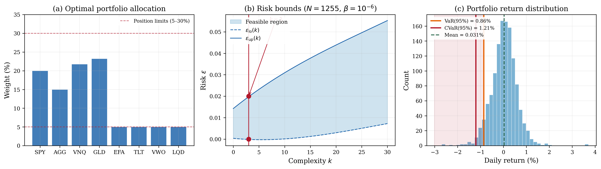

# CVaR Portfolio Optimization

## Problem Description

A pension fund must allocate capital across 8 ETF asset classes to minimize tail risk (Conditional Value-at-Risk) while satisfying regulatory allocation constraints. CVaR at the 95% level measures the average loss in the worst 5% of market scenarios — a coherent risk measure that captures the severity of extreme losses, not just their probability.

| Ticker | Asset | Class | Role |
|--------|-------|-------|------|
| SPY | S&P 500 ETF | US Equity | Core Growth |
| AGG | US Aggregate Bond | Fixed Income | Stability |
| VNQ | Real Estate (REIT) | Real Assets | Inflation Hedge |
| GLD | Gold | Commodities | Crisis Hedge |
| EFA | Intl Developed | Intl Equity | Diversification |
| TLT | 20+ Year Treasury | Long Bonds | Duration |
| VWO | Emerging Markets | Intl Equity | Growth |
| LQD | Investment Grade Corp | Credit | Yield |

Position limits are 5-30% per asset. Equities (SPY+EFA+VWO) must be 30-60%, fixed income (AGG+TLT+LQD) at least 25%. Scenario data is computed from 5 years of real daily ETF returns downloaded via yfinance, with each trading day as one scenario.

## Formulation

This is a Linear Program using the Rockafellar-Uryasev CVaR formulation with shared-slack augmentation. The original decision variable [w, alpha] in R^9 (8 portfolio weights + VaR threshold) is augmented with 4 slack variables zeta (one per scenario constraint) to form x_aug = [w, alpha, zeta] in R^13. The objective c_aug = [0,...,0, 1, rho, ..., rho] in R^13 minimizes alpha with rho = 1/((1-0.95)*N) ≈ 0.016 embedded in the cost vector, so the solver is called with rho = 0. This means alpha + rho*sum(zeta) approximates CVaR at the 95% level. No regularisation (tau = 0).

Each scenario delta_i in R^12 encodes 8 asset returns (delta[0:8]), a market stress indicator (delta[8]), credit spread shock (delta[9]), interest rate shock (delta[10]), and volatility scaling (delta[11]). The augmented scenario constraint matrix A_d (4 x 13) captures: (1) portfolio loss with stress amplification, (2) credit spread impact on bonds, (3) interest rate duration exposure, and (4) equity correlation breakdown during crises, with -I slack columns absorbing violations. Hard constraints (G: 27 x 13) encode position limits, budget (weights sum to 1), equity allocation range, fixed income minimum, VaR threshold bounds, and non-negativity on zeta.

## Results



The LP solves with N = 1,255 market scenarios (one per historical trading day). The optimizer tilts heavily toward alternatives: GLD (23.2%) and VNQ (21.8%) dominate, while equities sit at the 30% regulatory minimum and fixed income at 25%. This defensive posture minimizes tail risk — the CVaR(95%) is only 1.21% daily loss. The LP had complexity k = 3, no degeneracy, and risk bounds [0.0000, 0.0200].

## Files

```
LP_portfolio_cvar_13d/
├── README.md           This file
├── parameters.txt      Solver parameters (rho, tau, confidence)
├── generate.py         Download ETF data and generate augmented scenarios (requires yfinance)
├── run.py              Solve the LP and print results
├── plot.py             Generate the paper figure
├── data/
│   ├── benchmark.json  One-shot program definition (JSON)
│   ├── benchmark.mat   One-shot program definition (MATLAB)
│   ├── A_d.csv         Augmented scenario constraint matrix (4 x 13)
│   ├── b_d.csv         Scenario-dependent RHS vector (4 x 1, all zeros)
│   ├── c.csv           Augmented objective vector (13 x 1, includes rho)
│   ├── G.csv           Augmented hard constraint matrix (27 x 13)
│   ├── h.csv           Hard constraint RHS (27 x 1)
│   ├── scenarios.csv   1255 x 12 uncertainty scenarios
│   ├── assets.csv      Asset metadata
│   ├── historical_prices.csv   5-year ETF price history
│   └── historical_returns.csv  Daily returns
└── results/
    ├── metrics.json    Solver output (weights, CVaR, risk bounds)
    ├── solution.csv    Raw solution vector
    ├── portfolio_cvar.png   Paper figure (300 dpi)
    └── portfolio_cvar.pdf   Paper figure (vector)
```

## Usage

```bash
# Regenerate scenarios (requires yfinance and internet)
python generate.py --seed 42

# Solve the LP
python run.py

# Generate paper figure
python plot.py
```

## Web Interface Usage

### One-Shot Method (Recommended)

1. Start the web server: `python3 app.py`
2. Click **"Detect Program"** button (next to LP/QP/SDP tabs)
3. Upload `data/benchmark.json` or `data/benchmark.mat`
4. Upload `data/scenarios.csv` in the Scenarios box
5. Set solver to **MOSEK** and press **Solve**

### Manual Method

1. Select the **LP** tab, formulation: **Robust + Relaxation**
2. Upload or enter each matrix:
   - **A(delta)**: `data/A_d.csv`
   - **b(delta)**: `data/b_d.csv`
   - **c**: `data/c.csv`
   - **G**: `data/G.csv`
   - **h**: `data/h.csv`
3. Set parameters: rho = 0.015936, tau = 0, confidence (beta) = 1e-06
4. Upload `data/scenarios.csv` in the Scenarios box
5. Press **Solve**

### Expected Results

- Optimal cost: 0.05133721274593786
- Complexity k: 3
- Risk bounds: [0.0, 0.02002552248652564]
