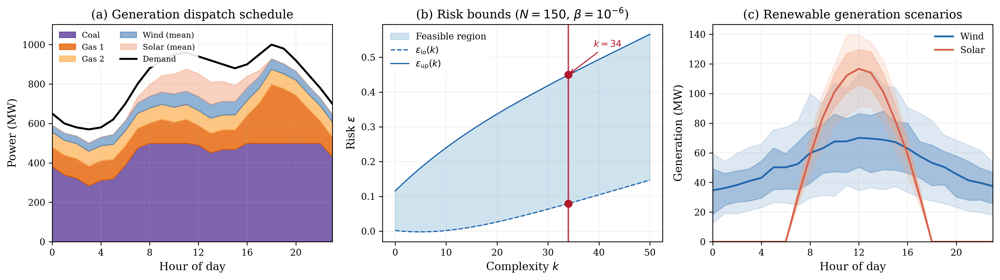

# Economic Dispatch with Renewable Uncertainty

## Problem Description

A grid operator must schedule three thermal generators over a 24-hour horizon to meet electricity demand while integrating uncertain wind and solar generation. Too little thermal dispatch risks blackouts when renewables underperform; too much wastes fuel when renewables are abundant. The operator must respect generator capacity limits, minimum output levels, and ramp-rate constraints that limit how quickly units can change output between consecutive hours.

| Generator | Capacity (MW) | Min Output (MW) | Cost ($/MWh) | Ramp Rate (MW/h) |
|-----------|--------------|-----------------|--------------|-------------------|
| Gas 1     | 400          | 100             | 40           | 200               |
| Gas 2     | 300          | 75              | 50           | 150               |
| Coal      | 500          | 200             | 30           | 100               |

The system also has a 200 MW wind farm and 150 MW solar farm. Peak demand is 1000 MW with a typical residential-commercial daily profile. Generator parameters are synthetic but calibrated to EIA cost data and standard thermal unit characteristics.

## Formulation

This is a Linear Program using the shared-slack augmented formulation. The original decision variable P in R^72 (hourly power output for 3 generators over 24 hours, P[m,t] for m = 0,1,2 and t = 0,...,23) is augmented with 48 slack variables zeta (one per scenario constraint) to form x_aug = [P; zeta] in R^120. The per-MWh generation costs and slack penalty rho = 100 are embedded in the cost vector c_aug = [40, ..., 40, 50, ..., 50, 30, ..., 30, 100, ..., 100] in R^120 (each generator cost repeated 24 times, then rho repeated 48 times), so the solver is called with rho = 0. No regularisation (tau = 0).

Each scenario delta_i in R^48 encodes uncertain hourly wind generation (delta[0:24]) and solar generation (delta[24:48]). Wind scenarios are drawn from a Weibull distribution (shape 2.0, hour-varying scale) with temporal autocorrelation. Solar scenarios use a Beta(2,5) cloudiness factor applied to a clear-sky envelope. The augmented scenario constraint matrix A_d (48 x 120) enforces power balance at each hour with -I slack columns absorbing imbalance. Hard constraints (G: 330 x 120) encode generator capacity limits, minimum output, ramp-rate limits, and non-negativity on zeta.

## Results



The LP solves with N = 150 scenarios. Total cost is $831,357 comprising $537,670 in generation cost and $293,687 in power imbalance penalty. Coal (cheapest at $30/MWh) provides baseload at 284-500 MW. Gas 1 ($40/MWh) ramps to cover evening peak, reaching 300 MW at hour 18. Gas 2 ($50/MWh) sits at its 75 MW minimum throughout. The LP had complexity k = 34, no degeneracy, and risk bounds [0.079, 0.443] at 99.9999% confidence (beta = 10^{-6}).

## Files

```
LP_power_dispatch_120d/
├── README.md           This file
├── parameters.txt      Solver parameters (rho, tau, confidence)
├── generate.py         Regenerate scenarios and augmented constraint matrices
├── run.py              Solve the LP and print results
├── plot.py             Generate the paper figure
├── data/
│   ├── program_symbolic.json  One-shot program definition (JSON)
│   ├── program_symbolic.json   One-shot program definition (MATLAB)
│   ├── A_d.csv         Augmented scenario constraint matrix (48 x 120)
│   ├── b_d.csv         Scenario-dependent RHS vector (48 x 1)
│   ├── c.csv           Augmented cost vector (120 x 1, includes rho)
│   ├── G.csv           Augmented hard constraint matrix (330 x 120)
│   ├── h.csv           Hard constraint RHS (330 x 1)
│   ├── demand.csv      Hourly demand profile (24 rows)
│   ├── generators.txt  Generator parameters
│   └── scenarios.csv   150 x 48 renewable generation scenarios
└── results/
    ├── metrics.json    Solver output (cost, dispatch, risk bounds)
    ├── solution.csv    Raw solution vector
    ├── power_dispatch.png   Paper figure (300 dpi)
    └── power_dispatch.pdf   Paper figure (vector)
```

## Usage

```bash
# Regenerate scenarios (optional)
python generate.py --n_scenarios 150 --seed 42

# Solve the LP
python run.py

# Generate paper figure
python plot.py
```

## Web Interface Usage

### One-Shot Method (Recommended)

1. Start the web server: `python3 app.py`
2. Click **"Upload Program"** button (next to LP/QP/SDP tabs)
3. Upload `data/program_symbolic.json` or `data/program_symbolic.json`
4. Upload `data/scenarios.csv` in the Scenarios box
5. Set solver to **MOSEK** and press **Solve**

### Manual Method

1. Select the **LP** tab, formulation: **Robust**
2. Upload or enter each matrix:
   - **A(delta)**: `data/A_d.csv`
   - **b(delta)**: `data/b_d.csv`
   - **c**: `data/c.csv`
   - **G**: `data/G.csv`
   - **h**: `data/h.csv`
3. Set parameters: rho = 0, tau = 0, confidence (beta) = 1e-06
4. Upload `data/scenarios.csv` in the Scenarios box
5. Press **Solve**

### Expected Results

- Optimal cost: 831357.4274826923
- Complexity k: 34
- Risk bounds: [0.07906891773454847, 0.44250483819283526]
