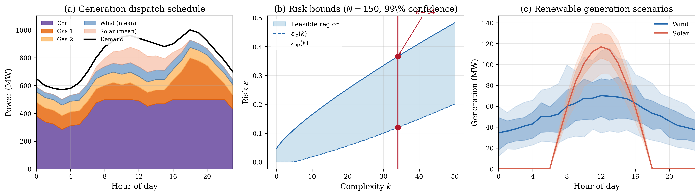

# Economic Dispatch with Renewable Uncertainty

## Problem Description

A grid operator must schedule three thermal generators over a 24-hour horizon to meet electricity demand while integrating uncertain wind and solar generation. Too little thermal dispatch risks blackouts when renewables underperform; too much wastes fuel when renewables are abundant. The operator must respect generator capacity limits, minimum output levels, and ramp-rate constraints that limit how quickly units can change output between consecutive hours.

| Generator | Capacity (MW) | Min Output (MW) | Cost ($/MWh) | Ramp Rate (MW/h) |
|-----------|--------------|-----------------|--------------|-------------------|
| Gas 1     | 400          | 100             | 40           | 200               |
| Gas 2     | 300          | 75              | 50           | 150               |
| Coal      | 500          | 200             | 30           | 100               |

The system also has a 200 MW wind farm and 150 MW solar farm. Peak demand is 1000 MW with a typical residential-commercial daily profile. Generator parameters are synthetic but calibrated to EIA cost data and standard thermal unit characteristics.

## Formulation

This is a Linear Program in the standard scenario approach form. The decision variable is x = P in R^72, representing hourly power output for three generators over 24 hours (P[m,t] for m = 0,1,2 and t = 0,...,23), with per-MWh generation costs c = [40, ..., 40, 50, ..., 50, 30, ..., 30] (each repeated 24 times), slack penalty rho = 100, and no regularisation (tau = 0).

Each scenario delta_i in R^48 encodes uncertain hourly wind generation (delta[0:24]) and solar generation (delta[24:48]). Wind scenarios are drawn from a Weibull distribution (shape 2.0, hour-varying scale) with temporal autocorrelation. Solar scenarios use a Beta(2,5) cloudiness factor applied to a clear-sky envelope. The scenario-dependent constraints enforce power balance at each hour: the 48 rows of A(delta) encode both upper and lower imbalance bounds. Hard constraints encode generator capacity limits, minimum output, and ramp-rate limits.

## Results



The LP solves with N = 150 scenarios. Total cost is $831,357 comprising $537,670 in generation cost and $293,687 in power imbalance penalty. Coal (cheapest at $30/MWh) provides baseload at 284-500 MW. Gas 1 ($40/MWh) ramps to cover evening peak, reaching 300 MW at hour 18. Gas 2 ($50/MWh) sits at its 75 MW minimum throughout. The LP had complexity k = 34, no degeneracy, and risk bounds [0.1194, 0.3659].

## Files

```
LP_power_dispatch_72d/
├── README.md           This file
├── parameters.txt      Solver parameters (rho, tau, confidence)
├── generate.py         Regenerate scenarios and constraint matrices
├── run.py              Solve the LP and print results
├── plot.py             Generate the paper figure
├── data/
│   ├── A_d.csv         Scenario-dependent constraint matrix (48 x 72)
│   ├── b_d.csv         Scenario-dependent RHS vector (48 x 1)
│   ├── c.csv           Cost vector (72 x 1)
│   ├── G.csv           Hard constraint matrix (282 x 72)
│   ├── h.csv           Hard constraint RHS (282 x 1)
│   ├── demand.csv      Hourly demand profile (24 rows)
│   ├── generators.txt  Generator parameters
│   └── scenarios.csv   150 x 48 renewable generation scenarios
└── results/
    ├── metrics.json    Solver output (cost, dispatch, risk bounds)
    ├── solution.csv    Raw solution vector
    ├── power_dispatch.png   Paper figure (300 dpi)
    └── power_dispatch.pdf   Paper figure (vector)
```

## Usage

```bash
# Regenerate scenarios (optional)
python generate.py --n_scenarios 150 --seed 42

# Solve the LP
python run.py

# Generate paper figure
python plot.py
```
