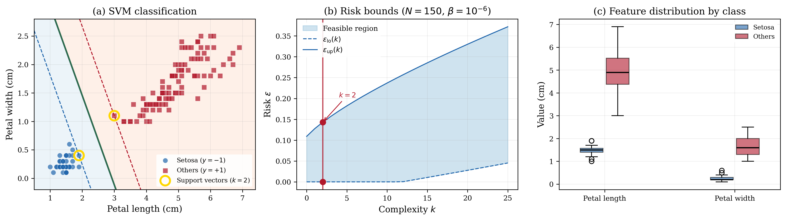

# Minimal Iris Classification

## Problem Description

The Iris dataset includes 150 iris plants belonging to three species (Setosa, Versicolor, Virginica), each described by four features. Using only petal length and petal width, Iris Setosa can be reliably separated from the other two species. We formulate this as a hard-margin SVM: find a separating hyperplane w'x + b = 0 that maximizes the margin between classes.

Each scenario δᵢ consists of the feature-label pair (δᵢ(1), δᵢ(2), δᵢ(3)), where the first two are petal measurements and the third is the binary class label (+1 or -1).

## Formulation

This is a Quadratic Program with 3 decision variables x = [w₁, w₂, b]. The objective minimizes (1/2)||w||² via Q = diag(1,1,0), c = [0,0,0]. Each scenario generates one soft constraint: yᵢ(w'xᵢ + b) ≥ 1. No hard constraints, no regularisation (τ = 0) or slack penalty (ρ = 0).

A(δᵢ) = [-δᵢ(1)·δᵢ(3), -δᵢ(2)·δᵢ(3), -δᵢ(3)], b(δᵢ) = 1

## Results



The QP solves with N = 150 data points achieving 100% training accuracy. The optimal classifier is 3.79 = 1.29x₁ + 0.82x₂ with margin 1.304. The complexity is k = 2 (two support vectors). With β = 10⁻⁶, the risk bounds are ε̲ = 0 and ε̄ = 0.143.

## Files

```
QP_Iris_minimal_3d/
├── README.md           This file
├── parameters.txt      Solver parameters (rho, tau, confidence)
├── run.py              Solve the QP and print results
├── plot.py             Generate the paper figure
├── data/
│   ├── benchmark.json  One-shot program definition (JSON)
│   ├── benchmark.mat   One-shot program definition (MATLAB)
│   ├── A_d.csv         Scenario-dependent constraint (1 × 3 expression)
│   ├── b_d.csv         Scenario-dependent RHS (constant = 1)
│   ├── c.csv           Linear objective vector (3 × 1)
│   ├── Q.csv           Quadratic objective matrix (3 × 3)
│   └── scenarios.csv   150 samples [petal_length, petal_width, label]
└── results/
    ├── metrics.json    Solver output (hyperplane, margin, risk bounds)
    ├── solution.csv    Raw solution vector [w1, w2, b]
    ├── iris_svm.png    Paper figure (300 dpi)
    └── iris_svm.pdf    Paper figure (vector)
```

## Usage

```bash
# Solve the QP
python run.py

# Generate paper figure
python plot.py
```

## Web Interface Usage

### One-Shot Method (Recommended)

1. Start the web server: `python3 app.py`
2. Click **"Detect Program"** button (next to LP/QP/SDP tabs)
3. Upload `data/benchmark.json` or `data/benchmark.mat`
4. Upload `data/scenarios.csv` in the Scenarios box
5. Set solver to **MOSEK** and press **Solve**

### Manual Method

1. Select the **QP** tab, formulation: **Robust**
2. Upload or enter each matrix:
   - **A(delta)**: `data/A_d.csv`
   - **b(delta)**: `data/b_d.csv`
   - **c**: `data/c.csv`
   - **Q**: `data/Q.csv`
3. Set parameters: rho = 0, tau = 0, confidence (beta) = 1e-06
4. Upload `data/scenarios.csv` in the Scenarios box
5. Press **Solve**

### Expected Results

- Optimal cost: 1.176470626281622
- Complexity k: 2
- Risk bounds: [0.0, 0.14300981911209715]
