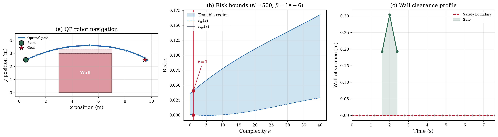

# QP Robot Navigation

## Problem Description

A point robot must navigate from start (0.5, 2.5) to goal (9.5, 2.5) through a 10.0 m x 8.0 m workspace containing a wide rectangular wall obstacle. The wall spans x = [3.0, 7.0] and y = [0.0, 3.0], blocking the direct path. The robot must arc above the wall, passing through the gap above the wall face at y = 3.0 with a safety clearance of 0.3 m (robot radius 0.2 m + margin 0.1 m). The wall face position is uncertain, perturbed by Gaussian noise with standard deviation sigma = 0.05 m. The robot has double-integrator dynamics with 20 discrete timesteps (dt = 0.4 s, total 8.0 s).

Each scenario delta_i is a 1-dimensional perturbation of the wall face y-position.

## Formulation

This is a Quadratic Program with 118 decision variables: 80 states (position and velocity at 20 timesteps) and 38 controls (acceleration over 19 intervals). The objective minimises a weighted combination of control effort (R = 1.0) and position tracking error (Q_pos = 10.0) relative to a straight-line reference from start to goal at y = 2.5. The wall constraint forces the robot above y = 3.3 at timesteps where the trajectory passes through the wall's x-range, creating the arc. Each scenario generates 3 constraints (one per constrained timestep). There are 320 hard constraints encoding dynamics, initial state, control limits, workspace bounds, and goal proximity.

| Parameter | Value |
|-----------|-------|
| Decision variables (d) | 118 |
| Scenarios (N) | 500 |
| Wall constraints per scenario | 3 |
| Hard constraints | 320 |
| Slack penalty (rho) | 0 |
| Regularisation (tau) | 0 |
| Confidence (1 - beta) | 0.99 |

## Results



The QP solves with N = 500 scenarios. The optimal trajectory has path length 9.79 m over 8.0 s, arcing smoothly above the wall with a minimum clearance of 0.19 m from the safety boundary. The complexity is k = 1 (one support constraint). With beta = 0.01, the risk bounds are eps_lower = 0 and eps_upper = 0.0196.

## Files

```
QP_cbf_robot_navigation_118d/
├── README.md           This file
├── parameters.txt      Solver parameters (rho, tau, confidence)
├── generate.py         Generate benchmark data (scenarios + QP matrices)
├── run.py              Solve the QP and print results
├── plot.py             Generate the paper figure
├── data/
│   ├── A_d.csv         Scenario-dependent constraint matrix (3 x 118)
│   ├── b_d.csv         Scenario-dependent RHS (3 expressions with delta)
│   ├── c.csv           Linear objective vector (118 x 1)
│   ├── Q.csv           Quadratic objective matrix (118 x 118)
│   ├── G.csv           Hard constraint matrix (320 x 118)
│   ├── h.csv           Hard constraint RHS (320 x 1)
│   └── scenarios.csv   500 samples (1D wall face perturbations)
└── results/
    ├── metrics.json    Solver output (trajectory, clearances, risk bounds)
    ├── solution.csv    Raw solution vector (118 x 1)
    ├── cbf_navigation.png   Paper figure (300 dpi)
    └── cbf_navigation.pdf   Paper figure (vector)
```

## Usage

```bash
# Generate benchmark data (optional, data already provided)
python generate.py [--n_scenarios 500] [--sigma 0.05]

# Solve the QP
python run.py

# Generate paper figure
python plot.py
```

## Web Interface Usage

### One-Shot Method (Recommended)

1. Start the web server: `python3 app.py`
2. Click **"Detect Program"** button (next to LP/QP/SDP tabs)
3. Upload `data/benchmark.json`
4. Upload `data/scenarios.csv` in the Scenarios box
5. Set solver to **MOSEK** and press **Solve**

### Manual Method

1. Select the **QP** tab, formulation: **Robust**
2. Upload or enter each matrix:
   - **A(delta)**: `data/A_d.csv`
   - **b(delta)**: `data/b_d.csv`
   - **c**: `data/c.csv`
   - **G**: `data/G.csv`
   - **h**: `data/h.csv`
   - **Q**: `data/Q.csv`
3. Set parameters: rho = 0, tau = 0, confidence (beta) = 0.01
4. Upload `data/scenarios.csv` in the Scenarios box
5. Press **Solve**

### Expected Results

- Optimal cost: -13777.807262403046
- Complexity k: 1
- Risk bounds: [0.0, 0.01956555154745001]
