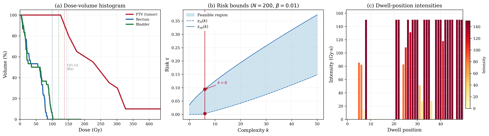

# Radiation Therapy -- Prostate Brachytherapy

## Problem Description

A medical physicist must design a brachytherapy treatment plan that delivers a prescribed dose of 145 Gy to the prostate while minimising dose to surrounding organs at risk (OARs). Catheter placement uncertainty of +/-5 mm occurs due to tissue deformation, needle deflection, and inter-fraction anatomy changes.

The treatment uses dose-influence data from the TROTS (The Rotterdam Optimisation Treatment Set) Prostate_BT_01 patient (Breedveld et al.). The original dataset has 55 catheters/dwell positions and 7 anatomical structures totalling approximately 35,000 voxels. We subsample to d = 50 dwell positions (selected by total dose contribution) and 100 representative voxels (selected by dose variance): 20 prostate (PTV), 30 rectum, 30 bladder, and 20 normal tissue. The nominal dose-influence matrix D in R^{100 x 50} relates dwell-position intensities to voxel doses, with entry D_{v,b} representing the dose deposited in voxel v by unit intensity of dwell position b.

Each scenario delta_i in R^3 encodes a catheter placement shift in three spatial directions (anterior-posterior, lateral, superior-inferior). A 5-level grid (5^3 = 125 scenarios) combined with 75 random samples from a truncated Gaussian (sigma = 2 mm) yields N = 200 scenarios. The perturbed dose-influence matrix follows an affine model D(delta) = D_0 + grad_x * delta[0] + grad_y * delta[1] + grad_z * delta[2], where the gradient matrices are computed via finite differences on the nominal dose-influence data.

## Formulation

This is a Quadratic Program (QP) in the scenario approach framework. The scenario-dependent constraint matrices enforce dose bounds under each catheter shift:

    A(delta_i) x + b(delta_i) <= 0

where A(delta_i) in R^{80 x 50} encodes 20 minimum tumour dose constraints (D_v(delta_i) x >= 137.75 Gy, i.e. 95% of the 145 Gy prescription), 30 maximum rectum dose constraints (D_v(delta_i) x <= 100 Gy), and 30 maximum bladder dose constraints (D_v(delta_i) x <= 120 Gy). The 100 hard constraints enforce non-negativity and upper bounds on each dwell-position intensity (0 <= x_b <= 150 Gy.s).

The objective minimises negative tumour dose (maximising target coverage) with L2 regularisation (tau = 0.1) to encourage physically smooth dwell-time profiles:

    min_x   c'x + (1/2) x'Qx + tau ||x||_2

where Q = D_PTV' D_PTV penalises dose inhomogeneity across tumour voxels and c encodes the negative mean tumour dose contribution of each dwell position. The problem is solved robustly (rho = 0): all dose constraints must hold for every scenario without slack relaxation.

## Results



The optimal plan achieves a tumour D95 = 145.12 Gy (exceeding the 137.75 Gy minimum), with maximum rectum dose of 84.6 Gy (below the 100 Gy limit) and maximum bladder dose of 101.6 Gy (below the 120 Gy limit).

Panel (a) shows the dose-volume histogram (DVH). The tumour curve drops steeply beyond the prescription dose, confirming adequate target coverage, while the long tail reflects the hot spots inherent to brachytherapy (high doses near dwell positions are physically unavoidable and clinically acceptable). Both OAR curves fall well within their respective dose constraints.

Panel (b) shows the Campi-Garatti risk bounds. The complexity is k = 6 with no degeneracy, yielding risk bounds [0.003, 0.094] at 99% confidence (beta = 0.01). This guarantees that the dose constraints will be satisfied for a new random catheter placement with probability at least 90.6%. The low complexity relative to d = 50 decision variables indicates that only a small number of catheter-shift scenarios are critical to the solution geometry.

Panel (c) displays the dwell-position intensity profile. Most channels carry high intensity (~150 Gy.s, the upper bound), with a few positions at low or zero intensity. This reflects the geometry of the prostate target relative to the catheter array: dwell positions near the centre of the PTV deliver maximum intensity, while those far from the target or near OARs are suppressed.

## Files

```
QP_radiation_therapy_50d/
├── README.md           This file
├── parameters.txt      Solver parameters (rho, tau, confidence)
├── generate.py         Generate dose matrices and scenarios from TROTS data
├── run.py              Solve the QP and print results
├── plot.py             Generate the paper figure
├── anatomy.txt         Structure definitions (voxel counts, dose limits)
├── scenarios.csv       200 x 3 catheter shift scenarios
├── A_d.csv             Affine constraint coefficients (80 x 50, with delta expressions)
├── b_d.csv             Constraint RHS values (80 x 1, with delta expressions)
├── Q.csv               Quadratic objective matrix (50 x 50)
├── c.csv               Linear objective vector (50 x 1)
├── G.csv               Hard constraint matrix (100 x 50)
├── h.csv               Hard constraint RHS (100 x 1)
├── D_nominal.csv       Nominal dose-influence matrix (100 x 50)
└── results/
    ├── metrics.json                              Solver output (cost, risk bounds, doses)
    ├── solution.csv                              Raw solution vector
    ├── prostate_brachytherapy_robust_planning.png   Paper figure (300 dpi)
    └── prostate_brachytherapy_robust_planning.pdf   Paper figure (vector)
```

## Usage

```bash
# Generate scenarios and constraint matrices from TROTS data (requires mat73)
python generate.py

# Solve the QP
python run.py

# Generate paper figure
python plot.py
```

## Web Interface Usage

### One-Shot Method (Recommended)

1. Start the web server: `python3 app.py`
2. Click **"Detect Program"** button (next to LP/QP/SDP tabs)
3. Upload `./benchmark.json`
4. Upload `./scenarios.csv` in the Scenarios box
5. Set solver to **MOSEK** and press **Solve**

### Manual Method

1. Select the **QP** tab, formulation: **Robust + Regularization**
2. Upload or enter each matrix:
   - **A(delta)**: `./A_d.csv`
   - **b(delta)**: `./b_d.csv`
   - **c**: `./c.csv`
   - **G**: `./G.csv`
   - **h**: `./h.csv`
   - **Q**: `./Q.csv`
3. Set parameters: rho = 0, tau = 0.1, confidence (beta) = 0.01
4. Upload `./scenarios.csv` in the Scenarios box
5. Press **Solve**

### Expected Results

- Optimal cost: 4698.836116109508
- Complexity k: 5
- Risk bounds: [0.000348460115492344, 0.08596500383573583]
