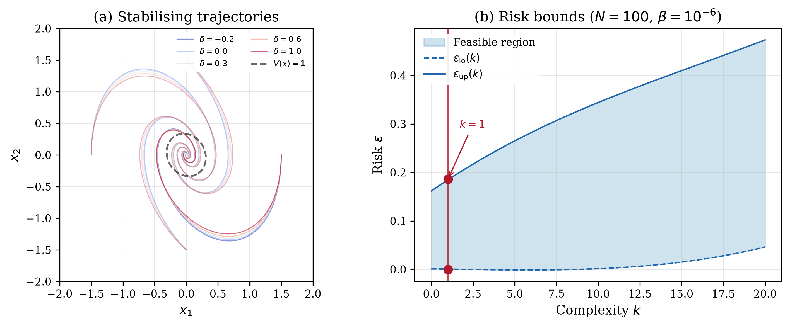

# LPV Stability Benchmark

## Problem Description

A 2x2 Linear Parameter-Varying (LPV) system dx/dt = A(delta)x models a damped oscillator whose stiffness and damping depend on a scheduling parameter delta in [-0.22, 1]. The system matrices are:

    A(delta) = A_0 + delta * A_1

    A_0 = [[0, 1], [-2, -1]]       (nominal stable oscillator)
    A_1 = [[0, 0], [0.3, 0.1]]     (parameter-varying perturbation)

The goal is to find a symmetric positive definite Lyapunov matrix P in R^{2x2} such that A(delta)'P + PA(delta) < 0 for all delta, certifying stability across the entire parameter range.

## Formulation

This is a Semidefinite Program (SDP) in the scenario approach inequality form. The decision variable is x = [p11, p12, p22] (3 independent elements of the symmetric 2x2 Lyapunov matrix P). Each scenario delta_i imposes a Linear Matrix Inequality (LMI):

    F_0(delta_i) + x_1 F_1(delta_i) + x_2 F_2(delta_i) + x_3 F_3(delta_i) <= zeta_i I

where F_j encode the Lyapunov equation A(delta)'P + PA(delta). A hard constraint E_0 + x_1 E_1 + x_2 E_2 + x_3 E_3 <= 0 enforces P > 0. The slack penalty is rho = 1.0 and there is no regularisation (tau = 0).

## Results



The SDP solves with N = 100 scenarios. The optimal Lyapunov matrix is:

    P = [[10.67, 1.30],
         [1.30,  9.01]]

The solver found complexity k = 1, meaning one scenario constraint is active at the optimal solution. This occurs at the upper boundary of the parameter range (delta near 1.0), where the system is closest to instability. With 99.9999% confidence (beta = 10^{-6}), the risk bounds are [0.000, 0.186], meaning at most 18.6% of parameter values could violate the certified stability condition. There is no degeneracy.

## Files

```
SDP_LPV_stability_3d/
├── README.md           This file
├── parameters.txt      Solver parameters (rho, tau, confidence)
├── generate.py         Generate scheduling parameter scenarios
├── run.py              Solve the SDP and print results
├── plot.py             Generate the paper figure
├── plot_data_only.py   Generate a figure of the trajectories only (no Lyapunov ellipse)
├── data/
│   ├── program_symbolic.json  Upload-Program definition (symbolic mode)
│   ├── program_numeric.json   Upload-Program definition (numeric mode)
│   ├── scenarios.csv          100 scheduling parameter samples
│   └── scenarios_numeric.csv  Per-row-flattened matrices for numeric mode
└── results/
    ├── metrics.json    Solver output (cost, risk bounds, etc.)
    ├── solution.csv    Raw solution vector
    ├── lpv_stability.png   Paper figure (300 dpi)
    ├── lpv_stability.pdf   Paper figure (vector)
    ├── lpv_trajectories_only.png   Trajectories-only figure (300 dpi)
    └── lpv_trajectories_only.pdf   Trajectories-only figure (vector)
```

## Usage

```bash
# Generate scenarios (optional)
python generate.py

# Solve the SDP (MOSEK by default; use --solver to pick another, e.g. CLARABEL)
python run.py
python run.py --solver CLARABEL

# Generate paper figure
python plot.py
```

## Web Interface Usage

### One-Shot Method (Recommended)

1. Start the web server: `python3 app.py`
2. Click **"Upload Program"** button (next to LP/QP/SDP tabs)
3. Upload `data/program_symbolic.json` (or `data/program_numeric.json` for numeric mode)
4. Upload `data/scenarios.csv` (or `data/scenarios_numeric.csv` with `program_numeric.json`) in the Scenarios box
5. Set solver to **MOSEK** and press **Solve**

### Manual Method

1. Select the **SDP** tab, formulation: **Relaxation**
2. Enter the matrices with their **Edit** buttons, using the matching fields of `data/program_symbolic.json`:
   - **F(delta)**: `F_d` (matrices F_0 ... F_3)
   - **E**: `E` (matrices E_0 ... E_3)
3. Enter:
   - **c**: `c`
   - **Q**: `Q`
4. Set parameters: rho = 1.0, tau = 0, confidence (beta) = 1e-06
5. Upload `data/scenarios.csv` in the Scenarios box
6. Press **Solve**

### Expected Results

- Optimal cost: -9.843942363753102
- Complexity k: 1
- Risk bounds: [0.0, 0.18583116631314622]
