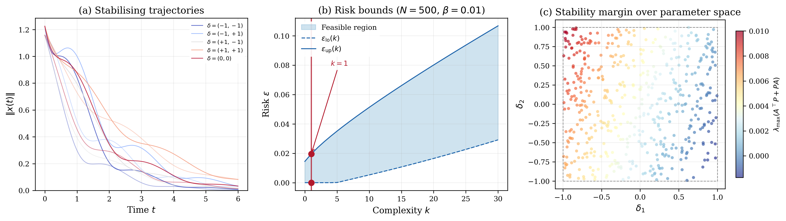

# Quadratic Stability Benchmark

## Problem Description

A 3x3 coupled oscillator LPV system dx/dt = A(delta)x has two uncertain parameters delta = (delta_1, delta_2) in [-1, 1]^2. The system matrices are:

    A(delta) = A_0 + delta_1 * A_1 + delta_2 * A_2

    A_0 = [[-0.3,  1.0,  0.0],        (nominal coupled oscillator)
           [-2.0, -1.0,  0.2],
           [ 0.2,  0.0, -1.2]]

    A_1 = [[0.0,  0.0,  0.0],         (stiffness/coupling uncertainty)
           [0.5,  0.15, 0.0],
           [0.0,  0.0,  0.3]]

    A_2 = [[0.0,  0.0,   0.0],        (damping uncertainty)
           [0.0,  0.3,   0.15],
           [0.15, 0.0,   0.45]]

The goal is to find a symmetric positive definite Lyapunov matrix P in R^{3x3} such that A(delta)'P + PA(delta) < 0 for all delta in [-1,1]^2, certifying quadratic stability over the entire 2D parameter space.

## Formulation

This is a Semidefinite Program (SDP) in the scenario approach inequality form. The decision variable is x = [p11, p12, p13, p22, p23, p33] (6 independent elements of the symmetric 3x3 Lyapunov matrix P). Each scenario delta_i in R^2 imposes a 3x3 LMI:

    F_0(delta_i) + sum_{j=1}^{6} x_j F_j(delta_i) <= 0

where F_j encode the Lyapunov equation structure. A hard constraint E_0 + sum x_j E_j <= 0 enforces P >= 0.01*I. The objective minimises trace(P) with a small quadratic regularisation (Q = 0.001*I). There is no slack penalty (rho = 0) and no regularisation (tau = 0).

## Results



The SDP solves with N = 500 scenarios. The optimal Lyapunov matrix is:

    P = [[0.0101, -0.0005,  0.0001],
         [-0.0005, 0.0127, -0.0003],
         [ 0.0001, -0.0003, 0.0100]]

with trace(P) = 0.033. The solver found complexity k = 1 with no degeneracy, meaning one scenario constraint is active at the optimal solution. The risk bounds at 99% confidence are [0.0000, 0.0196], meaning stability is certified for at least 98.0% of the parameter space.

## Files

```
Quadratic_Stability_6d/
├── README.md           This file
├── parameters.txt      Solver parameters (rho, tau, confidence)
├── generate.py         Generate scenarios and constraint matrices
├── run.py              Solve the SDP and print results
├── plot.py             Generate the paper figure
├── data/
│   ├── F_0.csv ... F_6.csv   Scenario-dependent LMI matrices
│   ├── E_0.csv ... E_6.csv   Hard constraint (P >= 0.01*I) matrices
│   ├── c.csv                  Linear objective vector (trace)
│   ├── Q.csv                  Quadratic regularisation matrix
│   └── scenarios.csv          500 x 2 parameter samples
└── results/
    ├── metrics.json    Solver output (cost, risk bounds, etc.)
    ├── solution.csv    Raw solution vector
    ├── quadratic_stability.png   Paper figure (300 dpi)
    └── quadratic_stability.pdf   Paper figure (vector)
```

## Usage

```bash
# Generate scenarios and constraint matrices (optional)
python generate.py

# Solve the SDP
python run.py

# Generate paper figure
python plot.py
```

## Web Interface Usage

### One-Shot Method (Recommended)

1. Start the web server: `python3 app.py`
2. Click **"Detect Program"** button (next to LP/QP/SDP tabs)
3. Upload `data/benchmark.json`
4. Upload `data/scenarios.csv` in the Scenarios box
5. Set solver to **MOSEK** and press **Solve**

### Manual Method

1. Select the **SDP** tab, formulation: **Robust**
2. Upload matrices using one of these approaches:

   **Option A — One-shot LMI upload:**
   - Click **Edit F(delta)** -> upload `data/benchmark.json` (the F_d section) as a JSON file, or enter the F_d dict
   - Click **Edit E** -> upload the E matrices similarly

   **Option B — Individual matrix entry:**
   - Click **Edit F(delta)** -> set n = 6 -> click each F_i button and upload `data/F_0.csv` through `data/F_6.csv`
   - Click **Edit E** -> set n = 6 -> click each E_i button and upload `data/E_0.csv` through `data/E_6.csv`

3. Upload or enter:
   - **c**: `data/c.csv`
   - **Q**: `data/Q.csv`
4. Set parameters: rho = 0.0, tau = 0, confidence (beta) = 0.01
5. Upload `data/scenarios.csv` in the Scenarios box
6. Press **Solve**

### Expected Results

- Optimal cost: 0.032858958578525506
- Complexity k: 1
- Risk bounds: [0.0, 0.01956555154745001]
