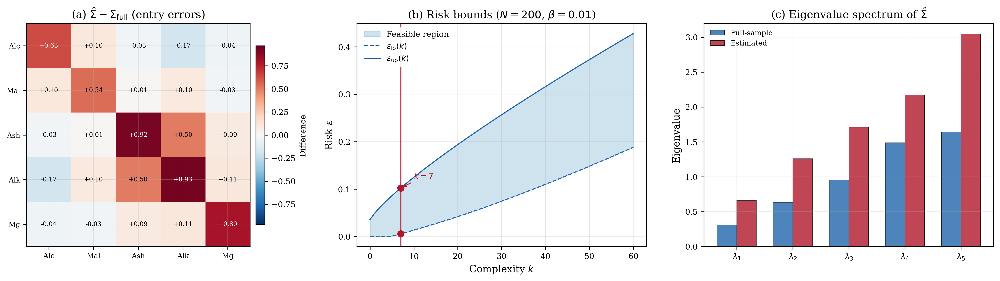

# Robust Covariance Estimation -- UCI Wine

## Problem Description

We seek the minimum-trace positive semidefinite covariance matrix Sigma that dominates all subsample covariances drawn from the UCI Wine dataset. This robust covariance estimation has applications in anomaly detection, portfolio risk, and Mahalanobis distance classification.

The Wine dataset contains 178 samples with 13 chemical measurements per wine. We select the first 5 features (alcohol, malic acid, ash, alcalinity of ash, magnesium), standardize each to zero mean and unit variance, and compute the full-sample covariance Sigma_full in R^{5 x 5}.

The decision variable is x = [sigma_11, sigma_12, ..., sigma_55] in R^15, the 15 entries of the 5 x 5 symmetric matrix Sigma = sum_{k=1}^{15} x_k Pi_k, where Pi_k are the standard basis matrices for the symmetric 5 x 5 space.

Each scenario delta_i in R^15 encodes the upper triangle of a subsample covariance S_sub, computed from 50 wines drawn uniformly at random without replacement (N = 200 scenarios).

## Formulation

This is a Semidefinite Program (SDP) in the scenario approach inequality form. The scenario-dependent constraint matrices encode covariance domination:

    F_0(delta_i) = S_sub(delta_i),   F_j(delta_i) = -Pi_j,   j = 1,...,15

so that S_sub(delta_i) - Sigma <= 0 (PSD sense), i.e., Sigma >= S_sub(delta_i). The hard constraint enforces Sigma > 0 via E_0 = 0 and E_j = -Pi_j. The objective uses c = [1, 0, 0, 1, ..., 1] and Q = 0, minimizing trace(Sigma). There is no slack penalty (rho = 0) and no regularization (tau = 0).

## Results



The optimal Sigma_hat has trace 8.84 and eigenvalues {0.66, 1.26, 1.71, 2.17, 3.05}, confirming positive definiteness. The Frobenius error ||Sigma_hat - Sigma_full||_F = 1.92 reflects the conservatism of the domination requirement: every subsample covariance must be dominated, inflating the diagonal entries. The complexity is k = 7, no degeneracy, and risk bounds [0.0055, 0.1022] at 99% confidence.

## Files

```
SDP_covariance_wine_15d/
├── README.md           This file
├── parameters.txt      Solver parameters (rho, tau, confidence)
├── generate.py         Generate subsample scenarios from Wine dataset
├── run.py              Solve the SDP and print results
├── plot.py             Generate the paper figure
├── data/
│   ├── scenarios.csv          200 x 15 subsample covariance scenarios
│   ├── basis_matrices.npy     15 x 5 x 5 symmetric basis matrices Pi_k
│   ├── free_entries.csv       Mapping of free entries in symmetric matrix
│   ├── c.csv                  Linear objective vector (trace)
│   ├── Q.csv                  Quadratic objective matrix (zero)
│   ├── E_0.csv ... E_15.csv   Hard constraint matrices (Sigma > 0)
│   ├── data_standardized.csv  Standardized wine data
│   ├── feature_names.txt      Feature labels
│   └── cov_full.csv           Full-sample covariance for comparison
└── results/
    ├── metrics.json                Solver output (cost, risk bounds, etc.)
    ├── solution.csv                Raw solution vector
    ├── Sigma_solution.csv          Reconstructed covariance matrix
    ├── robust_covariance_wine.png  Paper figure (300 dpi)
    └── robust_covariance_wine.pdf  Paper figure (vector)
```

## Usage

```bash
# Generate scenarios from Wine dataset (optional)
python generate.py

# Solve the SDP
python run.py

# Generate paper figure
python plot.py
```
