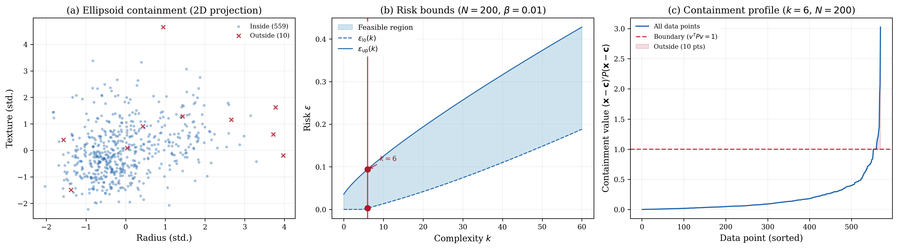

# Minimum Enclosing Ellipsoid -- Breast Cancer Wisconsin

## Problem Description

Given a collection of data points, we seek the tightest ellipsoid (in the trace sense) that contains all sampled observations. This is a fundamental problem in robust statistics and anomaly detection: the scenario approach provides probabilistic guarantees that unseen data points from the same distribution will also be contained.

The Breast Cancer Wisconsin dataset contains 569 samples with 30 features. We select the first 5 features (mean radius, mean texture, mean perimeter, mean area, mean smoothness) and standardize each to zero mean and unit variance, with data center x_bar = mean(data).

The decision variable is x = [p_11, p_12, ..., p_55] in R^15, the entries of the 5 x 5 symmetric shape matrix P = sum_{k=1}^{15} x_k Pi_k, defining the ellipsoid E = {z : (z - x_bar)' P (z - x_bar) <= 1}.

Each scenario delta_i in R^5 is a data point from the full dataset (N = 569 scenarios, one per sample).

## Formulation

This is a Semidefinite Program (SDP) in the scenario approach inequality form. The scenario-dependent constraint matrices encode point containment as a 1 x 1 (scalar) LMI:

    F_0(delta_i) = -1,   F_j(delta_i) = (delta_i - x_bar)' Pi_j (delta_i - x_bar),   j = 1,...,15

so that (delta_i - x_bar)' P (delta_i - x_bar) - 1 <= 0. The hard constraint enforces P > 0 via E_0 = 0 and E_j = -Pi_j. The objective uses c = [-1, 0, 0, -1, ..., -1] and Q = 0, maximizing trace(P) (i.e., minimizing -trace(P)) to find the tightest ellipsoid. There is no slack penalty (rho = 0) and no regularization (tau = 0).

## Results



The optimal P has trace 44.59 and eigenvalues {~0, ~0, ~0, ~0, 44.59}, revealing that the standardized data effectively lies in a 1-dimensional subspace (the first 5 breast cancer features are highly correlated). Since all 569 data points are used as scenarios, the ellipsoid contains all of them (100% containment). The complexity is k = 5 (five boundary data points define the ellipsoid), no degeneracy, and risk bounds [0.000, 0.052] at 99.9999% confidence, guaranteeing that a new random data point will fall inside the ellipsoid with probability at least 94.8%.

## Files

```
SDP_ellipsoid_enclosure_15d/
├── README.md           This file
├── parameters.txt      Solver parameters (rho, tau, confidence)
├── generate.py         Generate data point scenarios from Breast Cancer dataset
├── run.py              Solve the SDP and print results
├── plot.py             Generate the paper figure
├── data/
│   ├── program_symbolic.json      Upload-Program definition (symbolic mode)
│   ├── program_numeric.json       Upload-Program definition (numeric mode)
│   ├── scenarios.csv              569 x 5 data point scenarios
│   ├── scenarios_numeric.csv      Per-row-flattened matrices for numeric mode
│   ├── basis_matrices.npy         15 x 5 x 5 symmetric basis matrices Pi_k
│   ├── free_entries.csv           Mapping of free entries in symmetric matrix
│   ├── coeffs.csv                 Precomputed containment coefficients
│   ├── center.csv                 Data center x_bar
│   ├── cov_full.csv               Full-sample covariance
│   ├── data_standardized.csv      Full standardized dataset (569 x 5)
│   └── feature_names.txt          Feature labels
└── results/
    ├── metrics.json                     Solver output (cost, risk bounds, etc.)
    ├── solution.csv                     Raw solution vector
    ├── P_solution.csv                   Reconstructed shape matrix
    ├── minimum_enclosing_ellipsoid.png  Paper figure (300 dpi)
    └── minimum_enclosing_ellipsoid.pdf  Paper figure (vector)
```

## Usage

```bash
# Generate scenarios from Breast Cancer dataset (optional)
python generate.py

# Solve the SDP (MOSEK by default; use --solver to pick another, e.g. CLARABEL)
python run.py
python run.py --solver CLARABEL

# Generate paper figure
python plot.py
```

## Web Interface Usage

### One-Shot Method (Recommended)

1. Start the web server: `python3 app.py`
2. Click **"Upload Program"** button (next to LP/QP/SDP tabs)
3. Upload `data/program_symbolic.json` (or `data/program_numeric.json` for numeric mode)
4. Upload `data/scenarios.csv` (or `data/scenarios_numeric.csv` with `program_numeric.json`) in the Scenarios box
5. Set solver to **MOSEK** and press **Solve**

### Manual Method

1. Select the **SDP** tab, formulation: **Robust**
2. Enter the matrices with their **Edit** buttons, using the matching fields of `data/program_symbolic.json`:
   - **F(delta)**: `F_d` (matrices F_0 ... F_15)
   - **E**: `E` (matrices E_0 ... E_15)
3. Enter:
   - **c**: `c`
   - **Q**: `Q`
4. Set parameters: rho = 0.0, tau = 0.0, confidence (beta) = 1e-06
5. Upload `data/scenarios.csv` in the Scenarios box
6. Press **Solve**

### Expected Results

- Optimal cost: -44.594388865949526
- Complexity k: 5
- Risk bounds: [0.0, 0.05181163547131739]
